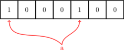
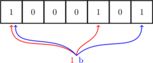
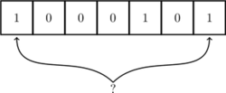

# 


## 1.笔 


### 1.问答题

```cpp
void *memcpy(void *dst, const void *src, size_t len) {
    if(!dst || !src) return NULL;
    void *ret = dst;
    if(dst <= src || (char *)dst >= (char *)src + len) {
    //没有内存重叠，从低地址开始复制
        while(len--) {
            *(char *)dst = *(char *)src;
            dst = (char *)dst + 1;
            src = (char *)src + 1;
        }
    }
    else {
        //有内存重叠，从高地址开始复制
        src = (char *)src + len - 1;
        dst = (char *)dst + len - 1;
        while(len--) {
            *(char *)dst = *(char *)src;
            dst = (char *)dst - 1;
            src = (char *)src - 1;
        }
    }
    return ret;
}
```

复制是从低地址开始复制，内存覆盖的情况:str的地址小于dst的地址，如果str-dst＜＝len, 那么str后半部分就会被覆盖。

### 2.问答题

STL中vector的实现原理 (衍生：Map, Set等实现原理)

vector的数据安排以及操作方式，与array非常相似。两者的唯一区别在于空间的运用的灵活性：   
1. array是静态空间，一旦配置了就不能改变；
2. 要换个大（或小）一点的房子，可以，一切琐细都得由客户端自己来：首先配置一块新空间，然后将元素从旧址一一搬往新址，再把原来的空间释还给系统。

1. vector是动态空间，随着元素的加入，它的内部机制会自行扩充空间以容纳新元素。因此，vector的运用对于内存的合理利用与运用的灵活性有很大的帮助，我们再也不必因为害怕空间不足而一开始要求一个大块头的array了，我们可以安心使用array，吃多少用多少。 

vector的实现技术，关键在于其对大小的控制以及重新配置时的数据移动效率。一旦vector的旧有空间满载，如果客户端每新增一个元素，vector的内部只是扩充一个元素的空间，实为不智。因为所谓扩充空间（不论多大），一如稍早所说，是”  配置新空间/数据移动/释还旧空间  “的大工程，时间成本很高，应该加入某种未雨绸缪的考虑。稍后我们便可看到SGI vector的空间配置策略了。 

另外，由于vector维护的是一个连续线性空间，所以vector支持随机存取。 

注意：vector动态增加大小时，并不是在原空间之后持续新空间（因为无法保证原空间之后尚有可供配置的空间），而是以原大小的两倍另外配置一块较大的空间，然后将原内容拷贝过来，然后才开始在原内容之后构造新元素，并释放原空间。因此，对vector的任何操作，一旦引起空间重新配置，指向原vector的所有迭代器就都失效了。这是程序员易犯的一个错误，务需小心。

1、Vector是顺序容器，是一个动态数组，支持随机存取、插入、删除、查找等操作，在内存中是一块连续的空间。在原有空间不够情况下自动分配空间。vector随机存取效率高，但是在vector插入元素，需要移动的数目多，效率低下。
2、Map是关联容器，以键值对的形式进行存储，方便进行查找。关键词起到索引的作用，值则表示与索引相关联的数据。以红黑树的结构实现，插入删除等操作都在O(logn)时间内完成
3、Set是关联容器，set中每个元素只包含一个关键字。set支持高效的关键字查询操作——检查一个给定的关键字是否在set中。set也是以红黑树的结构实现，支持高效插入、删除等操作。

### 3.问答题

给定N张扑克牌和一个随机函数，设计一个洗牌算法

1. 假定Ｎ=54，首先有能够产生1-54之间随机数的函数发生器；
2. 扑克牌是一个54元素的数组card，我们要做的就是：从card数组中随机取一个元素，然后在剩下的元素里再随机取一个元素，这里涉及到一个问题，就是每次取完元素后，我们就不会让这个元素参与下一次的选取。这样，我们就可以把第一次随机的索引x取的牌`card[x]`与第一个元素互换`card[0]`，第二次随机，在`[1,53]`内进行随机，然后让取出的牌与第二个元素`card[1]`交换……
3. 直到最后一张牌，不需要换，因为就是本身。

```cpp
void RandomShuffle(int a[], int n){ 
    for(int i=0; i<n; ++i){ 
        int j = rand() % (n-i) + i;// 产生i到n-1间的随机数 
        Swap(a[i], a[j]);//交换位置 
    } 
}
```

### 4.问答题

25匹马，5个跑道，每个跑道最多能有1匹马进行比赛，最少比多少次能比出前3名？前5名？

注意： "假设每匹马都跑的很稳定" 的意思是在上一场比赛中A马比B马快，则下一场比赛中A马依然比B马快。
 
稍微想一下，可以采用一种 竞标赛排序(Tournament Sort)的思路。 见《选择排序》
 
(1) 首先将25匹马分成5组，并分别进行5场比赛之后得到的名次排列如下：  
              A组：  [A1  A2  A3  A4  A5]  
              B组：  [B1  B2  B3  B4  B5]  
              C组：  [C1  C2  C3  C4  C5]  
              D组：  [D1  D2  D3  D4  D5]  
              E组：  [E1  E2  E3  E4  E5]  
其中，每个小组最快的马为[A1、B1、C1、D1、E1]。  
(2) 将[A1、B1、C1、D1、E1]进行第6场，选出第1名的马，不妨设 A1>B1>C1>D1>E1. 此时第1名的马为A1。  
(3) 将[A2、B1、C1、D1、E1]进行第7场，此时选择出来的必定是第2名的马，不妨假设为B1。因为这5匹马是除去A1之外每个小组当前最快的马。  
(3) 进行第8场，选择[A2、B2、C1、D1、E1]角逐出第3名的马。    
(4) 依次类推，第9，10场可以分别决出第4，5名的吗。  
 
因此，依照这种竞标赛排序思想，需要10场比赛是一定可以取出前5名的。  
 
 
仔细想一下，如果需要减少比赛场次，就一定需要在某一次比赛中同时决出2个名次，而且每一场比赛之后，有一些不可能进入前5名的马可以提前出局。 当然要做到这一点，就必须小心选择每一场比赛的马匹。我们在上面的方法基础上进一步思考这个问题，希望能够得到解决。  
 
(1) 首先利用5场比赛角逐出每个小组的排名次序是绝对必要的。  
(2) 第6场比赛选出第1名的马也是必不可少的。假如仍然是A1马(A1>B1>C1>D1>E1)。那么此时我们可以得到一个重要的结论：有一些马在前6场比赛之后就决定出局的命运了(下面绿色字体标志出局)。  
       A组：  [A1  A2  A3  A4  A5]  
       B组：  [B1  B2  B3  B4  B5]  
       C组：  [C1  C2  C3  C4  C5]  
       D组：  [D1  D2  D3  D4  D5]  
       E组：  [E1  E2  E3  E4  E5]  
(3) 第7场比赛是关键，能否同时决出第2，3名的马呢？我们首先做下分析：  
     在上面的方法中，第7场比赛[A2、B1、C1、D1、E1]是为了决定第2名的马。但是在第6场比赛中我们已经得到(B1>C1>D1>E1)，试问？有B1在的比赛，C1、D1、E1还有可能争夺第2名吗？ 当然不可能，也就是说第2名只能在A2、B1中出现。实际上只需要2条跑道就可以决出第2名，剩下C1、D1、E1的3条跑道都只能用来凑热闹的吗？  
     能够优化的关键出来了，我们是否能够通过剩下的3个跑道来决出第3名呢？当然可以，我们来进一步分析第3名的情况？  
     ● 如果A2>B1(即第2名为A2)，那么根据第6场比赛中的(B1>C1>D1>E1)。 可以断定第3名只能在A3和B1中产生。  
     ● 如果B1>A2(即第2名为B1)，那么可以断定的第3名只能在A2, B2,C1 中产生。  
     好了，结论也出来了，只要我们把[A2、B1、A3、B2、C1]作为第7场比赛的马，那么这场比赛的第2，3名一定是整个25匹马中的第2，3名。  
     我们在这里列举出第7场的2，3名次的所有可能情况：  
     ①  第2名=A2，第3名=A3  
     ②  第2名=A2，第3名=B1  
     ③  第2名=B1，第3名=A2  
     ④  第2名=B1，第3名=B2  
     ⑤  第2名=B1，第3名=C1  
 
(4)  第8场比赛很复杂，我们要根据第7场的所有可能的比赛情况进行分析。  
      ①  第2名=A2，第3名=A3。那么此种情况下第4名只能在A4和B1中产生。  
           ● 如果第4名=A4，那么第5名只能在A5、B1中产生。  
           ● 如果第4名=B1，那么第5名只能在A4、B2、C1中产生。  
           不管结果如何，此种情况下，第4、5名都可以在第8场比赛中决出。其中比赛马匹为[A4、A5、B1、B2、C1]  
      ②  第2名=A2，第3名=B1。那么此种情况下第4名只能在A3、B2、C1中产生。  
           ● 如果第4名=A3，那么第5名只能在A4、B2、C1中产生。  
           ● 如果第4名=B2，那么第5名只能在A3、B3、C1中产生。  
           ● 如果第4名=C1，那么第5名只能在A3、B2、C2、D1中产生。  
           那么，第4、5名需要在马匹[A3、B2、B3、C1、A4、C2、D1]七匹马中产生，则必须比赛两场才行，也就是到第9场角逐出全部的前5名。  
      ③  第2名=B1，第3名=A2。那么此种情况下第4名只能在A3、B2、C1中产生。  
           情况和②一样，必须角逐第9场  
      ④  第2名=B1，第3名=B2。 那么此种情况下第4名只能在A2、B3、C1中产生。  
           ● 如果第4名=A2，那么第5名只能在A3、B3、C1中产生。  
           ● 如果第4名=B3，那么第5名只能在A2、B4、C1中产生。  
           ● 如果第4名=C1，那么第5名只能在A2、B3、C2、D1中产生。  
            那么，第4、5名需要在马匹[A2、B3、B4、C1、A3、C2、D1]七匹马中产 生，则必须比赛两场才行，也就是到第9场角逐出全部的前5名。  
        ⑤  第2名=B1，第3名=C1。那么此种情况下第4名只能在A2、B2、C2、D1中产生。  
            ● 如果第4名=A2，那么第5名只能在A3、B2、C2、D1中产生。  
            ● 如果第4名=B2，那么第5名只能在A2、B3、C2、D1中产生。  
            ● 如果第4名=C2，那么第5名只能在A2、B2、C3、D1中产生。  
            ● 如果第4名=D1，那么第5名只能在A2、B2、C2、D2、E2中产生。  
             那么，第4、5名需要在马匹[A2、B2、C2、D1、A3、B3、C3、D2、E1]九匹马中 产 生，因此也必须比赛两场，也就是到第9长决出胜负。  
 
总结：最好情况可以在第8场角逐出前5名，最差也可以在第9场搞定。  

参考：【Google】25匹马的角逐 - 爪哇人 - ITeye博客  
http://hxraid.iteye.com/blog/662643

### 5.问答题

100亿个整数，内存足够，如何找到中位数？内存不足，如何找到中位数？

#### 内存足

用类似quick sort的思想，均摊复杂度为O(n)，算法思想如下： 

1. 随机选取一个元素，将比它小的元素放在它左边，比它大的元素放在右边；  
2. 如果它恰好在中位数的位置，那么它就是中位数，可以直接返回；  
3. 如果小于它的数超过一半，那么中位数一定在左半边，递归到左边处理；  
4. 否则，中位数一定在右半边，根据左半边的元素个数计算出中位数是右半边的第几大，然后递归 到右半边处理。  

#### 内存不⾜

方法⼀：⼆分法   
思路：一个重要的线索是，这些数都是整数。整数就有范围了，32位系统中就是`[-2^32, 2^32-1]`，有了范围我们就可以对这个范围进行二分，然后找有多少个数⼩于Mid,多少数大于mid，然后递归，和基于quicksort思想的第k大⽅方法类似  

方法二：分桶法  
思路：化大为小，把所有数划分到各个小区间，把每个数映射到对应的区间⾥里，对每个区间中数的个数进行计数，数一遍各个区间，看看中位数落在哪个区间，若够小，使⽤用基于内存的算法，否则继续划分。

对于分桶，具体来说：

- 题目说是整数，我们认为是带符号的int,所以4字节，占32位。  
- 假设100亿个数字保存在一个大文件中，依次读一部分文件到内存(不超过内存的限制)，将每个数字用二进制表示，比较二进制的最高位(第32位，符号位，0是正，1是负)，如果数字的最高位为0，则将这个数字写入 file_0文件中；如果最高位为 1，则将该数字写入file_1文件中。  
- 从而将100亿个数字分成了两个文件，假设 file_0文件中有 60亿 个数字，file_1文件中有 40亿 个数字。那么中位数就在 file_0 文件中，并且是 file_0 文件中所有数字排序之后的第 10亿 个数字。（file_1中的数都是负数，file_0中的数都是正数，也即这里一共只有40亿个负数，那么排序之后的第50亿个数一定位于file_0中）  
- 现在，我们只需要处理 file_0 文件了（不需要再考虑file_1文件）。对于 file_0 文件，同样采取上面的措施处理：将file_0文件依次读一部分到内存(不超内存限制)，将每个数字用二进制表示，比较二进制的 次高位（第31位），如果数字的次高位为0，写入file_0_0文件中；如果次高位为1，写入file_0_1文件中。  
- 现假设 file_0_0文件中有30亿个数字，file_0_1中也有30亿个数字，则中位数就是：file_0_0文件中的数字从小到大排序之后的第10亿个数字。  
- 抛弃file_0_1文件，继续对 file_0_0文件 根据 次次高位(第30位) 划分，假设此次划分的两个文件为：file_0_0_0中有5亿个数字，file_0_0_1中有25亿个数字，那么中位数就是 file_0_0_1文件中的所有数字排序之后的 第 5亿 个数。  
- 按照上述思路，直到划分的文件可直接加载进内存时，就可以直接对数字进行快速排序，找出中位数了。

## 2.C/C++基础(上)

### 6.问答题

请简述智能指针原理，并实现一个简单的智能指针。

智能指针是一种资源管理类，通过对原始指针进行封装，在资源管理对象进行析构时对指针指向的内存进行释放；通常使用引用计数方式进行管理，一个基本实现如下：

智能指针：实际指行为类似于指针的类对象 ，它的一种通用实现方法是采用引用计数的方法。  
1.智能指针将一个计数器与类指向的对象相关联，引用计数跟踪共有多少个类对象共享同一指针。    
2.每次创建类的新对象时，初始化指针并将引用计数置为1；   
3.当对象作为另一对象的副本而创建时，拷贝构造函数拷贝指针并增加与之相应的引用计数；  
4.对一个对象进行赋值时，赋值操作符减少左操作数所指对象的引用计数（如果引用计数为减至0，则删除对象），并增加右操作数所指对象的引用计数；这是因为左侧的指针指向了右侧指针所指向的对象，因此右指针所指向的对象的引用计数+1；  
5.调用析构函数时，构造函数减少引用计数（如果引用计数减至0，则删除基础对象）。  
6.实现智能指针有两种经典策略：一是引入辅助类，二是使用句柄类。这里主要讲一下引入辅助类的方法  

```cpp
//基础对象类，要做一个对Point类的智能指针  
class Point  
{  
public:  
    Point(int xVal = 0, int yVal = 0):x(xVal),y(yVal) { }  
    int getX() const { return x; }  
    int getY() const { return y; }  
    void setX(int xVal) { x = xVal; }  
    void setY(int yVal) { y = yVal; }  
private:  
    int x,y;
};

//辅助类，该类成员访问权限全部为private，因为不想让用户直接使用该类
class RefPtr {
    friend class SmartPtr; //定义智能指针类为友元，因为智能指针类需要直接操纵辅助类
    RefPtr(Point *ptr):p(ptr), count(1) {}
    ~RefPtr() { delete p; }

    int count; //引用计数
    Point *p;  //基础对象指针
};

//智能指针类
class SmartPtr {
public:
    SmartPtr(Point *ptr):rp(new RefPtr(ptr)) { }            //构造函数
    SmartPtr(const SmartPtr &sp):rp(sp.rp) { ++rp->count; } //复制构造函数
    SmartPtr& operator=(const SmartPtr& rhs) {              //重载赋值操作符
        ++rhs.rp->count;                                    //首先将右操作数引用计数加1，
        if(--rp->count == 0)                                //然后将引用计数减1，可以应对自赋值
            delete rp;
        rp = rhs.rp;
        return *this;
    }
    ~SmartPtr() {             //析构函数
        if(--rp->count == 0)  //当引用计数减为0时，删除辅助类对象指针，从而删除基础对象
            delete rp;
    }
private:
    RefPtr *rp;               //辅助类对象指针
};
```

### 7.问答题

如何处理循环引用问题？

循环引用，一般来说，有头文件循环引用和两个对象的循环引用！

#### 头文件循环引用

该循环引用会造成编译错误，如文件 `a.h`：

```cpp
#include "b.h"
class A {
B b;
//....
}
```

文件 `b.h`：

```cpp
#include "a.h"
class B {
//....
}
```

这样书写的话会造成互相引用，形成死循环，编译时通不过的，但可以使用前置声明解决，改后的文件 `a.h`：  

```cpp
class B;
class A {
 B b;
//....
}
```

文件 `b.h`：  

```cpp
#include "a,h"
class B {
//....
}
```

一起编译这两个类的cpp文件就能编译通过

#### 两个对象的循环引用

多见于智能指针如share_ptr。  
- 如果两个对象A和B都持有对方的强引用，假若A对象需要释放，但是B对象持有强引用，不能释放，B也是如此，这就造成了两个对象的互相等待，永远得不到释放；  
- 我们可以使用weak_ptr，weak_ptr只是获得对象的使用权，没有获得所有权，当对象A强引用B，B弱引用A，当A需要释放时，有余没有其他的对象引用它了，所以能够释放，B对象也没有其他对象引用，也可以释放。

### 8.问答题

请实现一个单例模式的类，要求线程安全


## 3.C/C++基础(下)

## 4.智力题

## 5.概率题与操作系统题

## 6.面向对象及数据结构设计

### 58.问答题

设计qps (query per sec)函数，用它控制api调用，使得api n毫秒内只能被调用m次?

设计合理即可，下面是一个参考思路： 
1. 维护一个窗口，窗口有左右两个边界。窗口内为从最后一次访问开始向前n毫秒所有的访问；    
2. 当新来一个访问，更新窗口右边界，打新的时间戳。向右移动窗口左边界，将距当前n毫秒外的访问删除；   
3. 统计次数看是否满足<= m次。  若满足说明未达到调用m次的最大限制，否则已达到。  

### 59.问答题

如何设计一个短网址服务系统？

设计合理即可，实现思路：将url哈希到一个唯一的数值，将这个数值转化为一个字符串，另外还需要考虑系统负载等因素。

#### 原理解析

当我们在浏览器里输入 http://t.cn/RlB2PdD 时

1. DNS首先解析获得 http://t.cn 的 IP 地址；  
2. 当 DNS 获得 IP 地址以后（比如：74.125.225.72），会向这个地址发送 HTTP GET 请求，查询短码 RlB2PdD ， http://t.cn 服务器会通过短码 RlB2PdD 获取对应的长 URL；  
3. 请求通过 HTTP 301 转到对应的长 URL https://m.helijia.com 。  

这里有个小的知识点，为什么要用 301 跳转而不是 302 呐？

301 是永久重定向，302 是临时重定向。短地址一经生成就不会变化，所以用 301 是符合 http 语义的。同时对服务器压力也会有一定减少。
但是如果使用了 301，我们就无法统计到短地址被点击的次数了。而这个点击次数是一个非常有意思的大数据分析数据源。能够分析出的东西非常非常多。所以选择302虽然会增加服务器压力，但是我想是一个更好的选择。  
参考：来自知乎 iammutex 的答案https://www.zhihu.com/question/29270034/answer/46446911

#### 算法解析

网上比较流行的算法有两种 自增序列算法、 摘要算法

##### 算法一

自增序列算法，也叫永不重复算法。设置 id 自增，一个 10进制 id 对应一个 62进制的数值，1对1，也就不会出现重复的情况。这个利用的就是低进制转化为高进制时，字符数会减少的特性。

如十进制 10000，对应不同进制的字符表示，2进制最长，62和64进制最短，只有3位数。

短址的长度一般设为 6 位，而每一位是由 [a - z, A - Z, 0 - 9] 总共 62 个字母组成的，所以 6 位的话，总共会有 62^6 ~= 568亿种组合，基本上够用了。

哈哈，这里附上一个进制转换工具 http://tool.lu/hexconvert/ 上图的数据就是用这个工具生成的。

具体的算法实现，自行谷歌。

##### 算法二

1. 将长网址 md5 生成 32 位签名串,分为 4 段, 每段 8 个字节；  
2. 对这四段循环处理, 取 8 个字节, 将他看成 16 进制串与 0x3fffffff(30位1) 与操作, 即超过 30 位的忽略处理；  
3. 这 30 位分成 6 段, 每 5 位的数字作为字母表的索引取得特定字符, 依次进行获得 6 位字符串；  
4. 总的 md5 串可以获得 4 个 6 位串,取里面的任意一个就可作为这个长 url 的短 url 地址。  

这种算法，虽然会生成4个，但是仍然存在重复几率。

##### 两种算法对比

- 第一种算法的好处就是简单好理解，永不重复。但是短码的长度不固定，随着 id 变大从一位长度开始递增。如果非要让短码长度固定也可以就是让 id 从指定的数字开始递增就可以了。百度短网址用的这种算法。上文说的开源短网址项目 YOURLS 也是采用了这种算法。[源码学习](https://github.com/YOURLS/YOURLS/blob/master/includes/functions.php)  
- 第二种算法，存在碰撞（重复）的可能性，虽然几率很小。短码位数是比较固定的。不会从一位长度递增到多位的。据说微博使用的这种算法。

我使用的算法一。有一个不太好的地方就是出现的短码是有序的，可能会不安全。我的处理方式是构造 62 进制的字母不要按顺序排列。因为想实现自定义短码的功能，我又对算法一进行了优化，下文会介绍。

参考：https://hufangyun.com/2017/short-url/

### 60.问答题

如何设计一个网页爬虫系统？

设计合理即可，实现思路：  
- 使用bfs算法进行网站爬取；
- 使用master节点作为控制节点控制worker节点进行网站爬取；  
- 使用分布式队列做任务调度；  
- 使用key-value存储（如redis)做网页判重。

## 7.大数据

### 61.问答题

- 给一个超过100G大小的log file, log中存着IP地址, 设计算法找到出现次数最多的IP地址？  
- 与上题条件相同，如何找到top K的IP？如何直接用Linux系统命令实现？  

Hash分桶法：   
1. 使用Hash分桶法把数据分发到不同文件。将100G文件分成1000份，将每个IP地址映射到相应文件中：file_id = hash(ip) % 1000 。或者直接对行号进行mod；  
2. 各个文件分别统计top K。在每个文件中分别求出最高频的IP；  
3. 合并 Hash分桶法的结果，得到Top K汇总。 

Linux命令，假设top 10，这里给出两种方法：
1. `sort log_file | uniq -c | sort -nr k1,1 | head -10`  
2. `cat logfile | sort -r | uniq | awk NR==排行数`  

其中，`sort log_file | uniq -c`可以统计`log_file`文件中每行先排序，再统计每行出现的次数。

### 62.问答题

给定100亿个整数，设计算法找到只出现一次的整数

- 如果是有符号整数的话，范围为`-2147483648~2147483647`，无符号整数为`0~4294967296`。有符号的使用两个bitset，一个存放正数，一个负数。   
- 每个数使用两个位来判断其出现几次。00表示出现0词，01出现1次，10出现大于一次。  

比如说存放整数100，就将bitset的第`100*2`位设置为+1，当所有数放完之后，对每两位进行测试看其值为多少？若是第i为与i+1为的值为01，则这个整数：`i*2`，在集合中只出现了1次。需要总共用`bitnum=(2^31*2)`个位表示，因为是位，1字节占8位，所以总共有`2^31*2/8`字节，从B到KB到MB，总共需空间为`int[bitnum]`，即512M。

#### 补充: Bloom filter  

Bloom filter 是由 Howard Bloom 在 1970 年提出的二进制向量数据结构，它具有很好的空间和时间效率，被用来检测一个元素是不是集合中的一个成员。

##### 计算方法

如需要判断一个元素是不是在一个集合中，我们通常做法是把所有元素保存下来，然后通过比较知道它是不是在集合内，链表、树都是基于这种思路，当集合内元素个数的变大，我们需要的空间和时间都线性变大，检索速度也越来越慢。

Bloom filter 采用的是哈希函数的方法，将一个元素映射到一个 m 长度的阵列上的一个点，当这个点是 1 时，那么这个元素在集合内，反之则不在集合内。这个方法的缺点就是当检测的元素很多的时候可能有冲突，解决方法就是使用 k 个哈希 函数对应 k 个点，如果所有点都是 1 的话，那么元素在集合内，如果有 0 的话，元素则不在集合内。

##### 优缺点

- Bloom filter 优点就是它的插入和查询时间都是常数，另外它查询元素却不保存元素本身，具有良好的安全性。  
- 它的缺点也是显而易见的，当插入的元素越多，错判“在集合内”的概率就越大了，另外 Bloom filter 也不能删除一个元素，因为多个元素哈希的结果可能在 Bloom filter 结构中占用的是同一个位，如果删除了一个比特位，可能会影响多个元素的检测。

##### 简单例子

下面是一个简单的 Bloom filter 结构，开始时集合内没有元素


当来了一个元素 a，进行判断，这里哈希函数有两个，计算出对应的比特位上为 0 ，即是 a 不在集合内，将 a 添加进去：



之后的元素，要判断是不是在集合内，也是同 a 一样的方法，只有对元素哈希后对应位置上都是 1 才认为这个元素在集合内（虽然这样可能会误判）：



随着元素的插入，Bloom filter 中修改的值变多，出现误判的几率也随之变大，当新来一个元素时，满足其在集合内的条件，即所有对应位都是 1 ，这样就可能有两种情况，一是这个元素就在集合内，没有发生误判；还有一种情况就是发生误判，出现了哈希碰撞，这个元素本不在集合内。



参考：bloom filter_百度百科  
- https://baike.baidu.com/item/bloom%20filter/6630926

### 63.问答题

给两个文件，分别有100亿个整数，我们只有1G内存，如何找到两个文件交集

使用hash函数将第一个文件的所有整数映射到1000个文件中，每个文件有1000万个整数，大约40M内存，
内存可以放下，把1000个文件记为 a1,a2,a3.....a1000,用同样的hash函数映射第二个文件到1000个文件中，这1000个文件记为b1,b2,b3......b1000，由于使用的是相同的hash函数，所以两个文件中一样的数字会被分配到文件下标一致的文件中，分别对a1和b1求交集，a2和b2求交集，ai和bi求交集，最后将结果汇总，即为两个文件的交集

另有人回答：  
1. 其实这个问题考的知识点是分治法（Divide and Conquer），具体做法楼上通过hash切割文件的答案已经给出来了  
2. 使用bitmap的从内存占用方面感觉不太合适，使用分治法的算法内存占用少，大不了我多创建几个进程同时跑，从性能和内存综合来讲还是最优的  

#### 补充：bitmap

来自于《编程珠玑》。

所谓的Bit-map就是用一个bit位来标记某个元素对应的Value，而Key即是该元素。由于采用了Bit为单位来存储数据，因此在存储空间方面，可以大大节省。

假设我们要对0-7内的5个元素(4,7,2,5,3)排序（这里假设这些元素没有重复）。那么我们就可以采用Bit-map的方法来达到排序的目的。要表示8个数，我们就只需要8个Bit（1Bytes）：

- 首先我们开辟1Byte的空间，将这些空间的所有Bit位都置为0；
- 然后遍历这5个元素，首先第一个元素是4，那么就把4对应的位置为1（可以这样操作 p+(i/8)|(0×01<<(i%8))，当然了这里的操作涉及到Big-ending和Little-ending的情况，这里默认为Big-ending）,因为是从零开始的，所以要把第五位置为1；  
- 然后再处理第二个元素7，将第八位置为1,，接着再处理第三个元素，一直到最后处理完所有的元素，将相应的位置为1。  
- 然后我们现在遍历一遍Bit区域，将该位是一的位的编号输出（2，3，4，5，7），这样就达到了排序的目的。  
- 其实就是把计数排序用的统计数组的每个单位缩小成bit级别的布尔数组。

### 64.问答题

1个文件有100亿个int，1G内存，设计算法找到出现次数不超过2次的所有整数?

先hash到多个文件中，每个文件中的整数用位图表示，一个字节就可以表示4个整数。最后把每个文件中不超过两次的整数和在一起就是答案。

每个数用不到4位，用2位表示数出现的次数，即00表示未出现，01表示出现1次，10表示出现两次，11表示两次以上。然后扫描100亿个数，查看位图中对应的位置，如果是00,01,10，则加1变成01,10,11；如果是11，则不变。最后再扫描一遍位图，输出01，10对应的数。

因所有的数均为int，且100亿超过了int的表示范围，那么就设置bitmap的长度为所有int，即2^32长度，又因为每个数占用2位，所以总共所需要的位数为：2^32 * 2 = 8Gbits，1字节=8位，也就相当于1GB空间。

### 65.问答题

给两个文件，分别有100亿个query，我们只有1G内存，如何找到两个文件交集？分别给出精确算法和近似算法?

精确算法：Hash分桶法  
1，将两个文件中的query hash到N个小文件中，并标明query的来源  
2. 在各个小文件中找到重合的query，来源文件，对应行号（也可不记录行号，只记录来源文件，用2位，01表示来自文件B，10表示来自文件A，11表示重合）     
3. 将所有结果遍历一边，得到文件交集，或者是在第二步的时候若为11则记录重复，就不需要再次扫描  

近似算法：BloomFilter

### 66.问答题

如何扩展BloomFilter使得它支持删除元素的操作？

- BloomFilter本来就是拿来处理大量数据的，假设是10亿个int映射到位图，一个位一个计数器，需要慎重选择数据类型吧，否则放不得下计数器；  
- 将Bloomfilter中的每一位扩展为一个计数器，记录有多少个hash函数映射到这一位；删除的时候，只有当“引用计数”变为0时，才真正将该位置0。

### 67.问答题

如何扩展BloomFilter使得它支持计数操作？

- 将Bloomfilter中的每一位扩展为一个计数器，每个输入元素都要把对应位置加1，从而支持计数 操作。计数个数为，所有映射到的位置中计数的最小值；  
- 但这种做法并不完美，如果输入元素k对应的计数位最小值为m，只能说明k出现的次数不大于m。不能说明k出现的次数等于m。

### 68.问答题

给上千个文件，每个文件大小为1K—100M。给n个词，设计算法对每个词找到所有包含它的文件，你只有100K内存

#### 方法1 trie树/字典树

又称单词查找树，Trie树，是一种树形结构，是一种哈希树的变种。典型应用是用于统计，排序和保存大量的字符串（但不仅限于字符串），所以经常被搜索引擎系统用于文本词频统计。它的优点是：利用字符串的公共前缀来减少查询时间，最大限度地减少无谓的字符串比较，查询效率比哈希树高。

3个基本性质：根节点不包含字符，除根节点外每一个节点都只包含一个字符；从根节点到某一节点，路径上经过的字符连接起来，为该节点对应的字符串； 每个节点的所有子节点包含的字符都不相同。

搜索字典项目的方法为：  
(1) 从根结点开始一次搜索；  
(2) 取得要查找关键词的第一个字母，并根据该字母选择对应的子树并转到该子树继续进行检索；  
(3) 在相应的子树上，取得要查找关键词的第二个字母,并进一步选择对应的子树进行检索。  
(4) 迭代过程……  
(5) 在某个结点处，关键词的所有字母已被取出，则读取附在该结点上的信息，即完成查找。  
其他操作类似处理  

应用1：串的快速检索   
- 给出N个单词组成的熟词表，以及一篇全用小写英文书写的文章，请你按最早出现的顺序写出所有不在熟词表中的生词。   
- 在这道题中，我们可以用数组枚举，用哈希，用字典树，先把熟词建一棵树，然后读入文章进行比较，这种方法效率是比较高的。  

应用2：“串”排序  
- 给定N个互不相同的仅由一个单词构成的英文名，让你将他们按字典序从小到大输出  
- 用字典树进行排序，采用数组的方式创建字典树，这棵树的每个结点的所有儿子很显然地按照其字母大小排序。对这棵树进行先序遍历即可。  

应用3：最长公共前缀  
- 对所有串建立字典树，对于两个串的最长公共前缀的长度即他们所在的结点的公共祖先个数，于是，问题就转化为当时公共祖先问题。  

#### 方法2 布隆过滤器

1. 用一个文件info 准备用来保存ｎ个词和包含其的文件信息；  
2. 首先把ｎ个词分成ｘ份。对每一份用生成一个布隆过滤器（因为对ｎ个词只生成一个布隆过滤器，内存可能不够用）。把生成的所有布隆过滤器存入外存的一个文件Filter中；  
3. 将内存分为两块缓冲区，一块用于每次读入一个布隆过滤器，一个用于读文件(读文件这个缓冲区使用相当于有界生产者消费者问题模型来实现同步)，大文件可以分为更小的文件，但需要存储大文件的标示信息（如这个小文件是哪个大文件的）；  
4. 对读入的每一个单词用内存中的布隆过滤器来判断是否包含这个值，如果不包含，从Filter文件中读取下一个布隆过滤器到内存，直到包含或遍历完所有布隆过滤器。如果包含,更新info 文件。直到处理完所有数据。删除Filter文件。

备注：
１：关于布隆过滤器：其实就是一张用来存储字符串hash值的BitMap.
２：可能还有一些细节问题，如重复的字符串导致的重复计算等要考虑一下。

### 69.问答题

有一个词典，包含N个英文单词，现在任意给一个字符串，设计算法找出包含这个字符串的所有英文单词

论坛里的三种方法  
1. ac自动机；  
2. 倒排索引。给输入字符串，利用字母建立倒排索引，索引中存储该字母 出现在哪个单词以及在单词中位置；查询时，利用倒排找到所有的单词，并求交集并且位置要连续；  
3. key-value。key是单词的字典顺序排序，value是含有这些字母的单词，对于给定字符串str，先进行字典排序，然后找到对应的value就可以了。貌似时间复杂度和空间复杂度不太好。  

我的方法  
0. 问题可以转化为，对于任意一个字符串，如果该字符串的所有词均在字典中，则返回true否则false。  
1. 初始化字典：把字典所有词哈希到一个表，把词作为key，value表示出现次数，得到字典哈希表；
2. 遍历字符串：对字符串中的每个单词哈希，看是否在字典哈希表的key集合中，若存在，则下一个，直到到字符串最后一个词，则返回true，若有某个不在词典哈希表中，则返回false。

